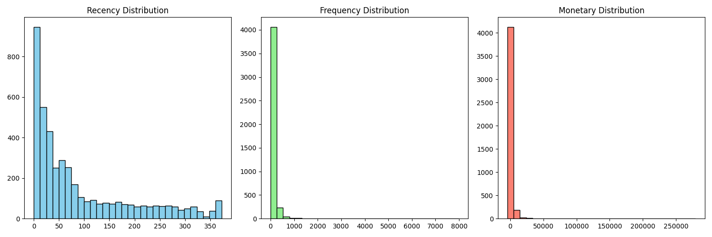
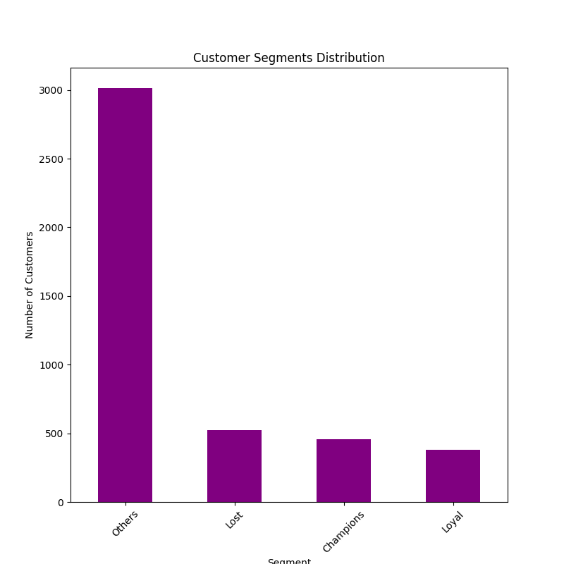

# Chat with Your Data (E-commerce Analysis)

This project explores an **E-commerce dataset** using **DuckDB + Python** for analysis and visualization.  
We apply **EDA (Exploratory Data Analysis)** and **RFM (Recency, Frequency, Monetary) segmentation** to understand customer behavior.

---

## 📂 Project Structure
chat-with-your-data/
│── data/ # Raw dataset (CSV)
│── src/ # Python scripts (EDA, RFM, etc.)
│── reports/ # Generated plots & outputs
│── README.md # Project documentation
│── requirements.txt # Dependencies


---

## 📊 Exploratory Data Analysis (EDA)

- Checked missing values & duplicates
- Revenue trends
- Customer purchase behavior

**Histograms of RFM Metrics:**



---

## 👥 Customer Segmentation (RFM Analysis)

We segmented customers into groups such as:
- **Loyal** (frequent buyers, high spenders)
- **Lost** (haven’t purchased recently)
- **Potential** (recently active, but not yet frequent)
- **Others**

**Customer Segment Distribution:**



---

## 🚀 Next Steps
- Build **LLM-powered assistant** to query data
- Deploy interactive dashboards

---

## Requirements
- Python 3.9+
- DuckDB
- Pandas
- Matplotlib / Seaborn

---

## ⚙️ Setup Instructions
```bash
# Create virtual environment
python -m venv virtual
source virtual/bin/activate   # (Mac/Linux)
virtual\Scripts\activate      # (Windows)

# Install dependencies
pip install -r requirements.txt

# Run EDA
python src/eda.py

